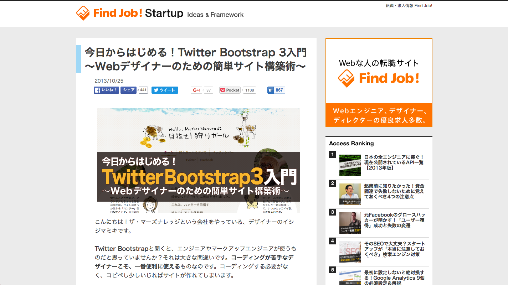

## Web Designing

* [Web Designing: 2013年10月号](https://book.mynavi.jp/wd/2013/10.html)

## Web Proffesional

* [ASCII.jp：失敗写真を諦めない！歪みを60秒で直すPhotoshopテク](http://ascii.jp/elem/000/000/885/885020/)
* [ASCII.jp：動画：Photoshopで共通パーツを効率よく作る方法](http://ascii.jp/elem/000/000/885/885387/)
* [ASCII.jp：23秒で冬景色が夏景色に！驚きのPhotoshopテク！](http://ascii.jp/elem/000/000/757/757209/)
* [ASCII.jp：ジャマな背景を19秒で消す、驚愕のPhotoshopテク！](http://ascii.jp/elem/000/000/755/755452/)
* [ASCII.jp：動画：Photoshopで共通パーツを効率よく作る方法](http://ascii.jp/elem/000/000/885/885387/)
* [ASCII.jp：PhotoshopでHDR風画像を写真1枚から作る方法（動画）](http://ascii.jp/elem/000/000/885/885430/)
* [ASCII.jp：イシジマミキの実践！「シングルページ」デザイン塾](http://ascii.jp/elem/000/000/921/921521/)

## Findjob! Startup

* [配色はiPhoneだけでOK！WebデザイナーのためのiOS版Adobe Kuler入門｜Find Job! Startup](http://www.find-job.net/startup/iphone-adobe-kuler)
* [年末までにjQueryをマスターしたい人必見！導入マニュアル＋すぐ使える厳選プラグイン｜Find Job! Startup](http://www.find-job.net/startup/jquery-plugin)
* [今日からはじめる！Twitter Bootstrap 3入門 〜Webデザイナーのための簡単サイト構築術〜｜Find Job! Startup](http://www.find-job.net/startup/twitter-bootstrap-3)
* [●●っぽい表現ができる「CSS3」サンプル集｜Find Job! Startup](http://www.find-job.net/startup/css3-sample)